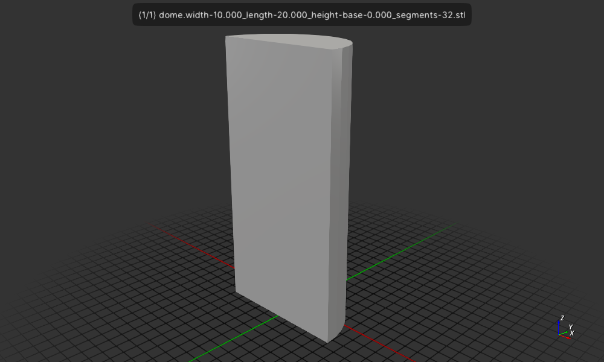

# Domed rectangle

Create a 3D model of a rectangle with a dome on top
this is using CSG::circle_with_flat.

## Install

```
cargo install --path .
```
## Run


```
$ cargo run
```

Display the result
```
$ f3d dome.width-10.000_length-20.000_height-base-0.000_segments-32.stl 
```

Output a png image of the result
```
$ f3d dome.width-10.000_length-20.000_height-base-0.000_segments-32.stl --output dome.width-10.000_length-20.000_height-base-0.000_segments-32.stl.png
```



## License

Licensed under either of

- Apache License, Version 2.0 ([LICENSE-APACHE](LICENSE-APACHE) or http://apache.org/licenses/LICENSE-2.0)
- MIT license ([LICENSE-MIT](LICENSE-MIT) or http://opensource.org/licenses/MIT)

### Contribution

Unless you explicitly state otherwise, any contribution intentionally submitted
for inclusion in the work by you, as defined in the Apache-2.0 license, shall
be dual licensed as above, without any additional terms or conditions.
